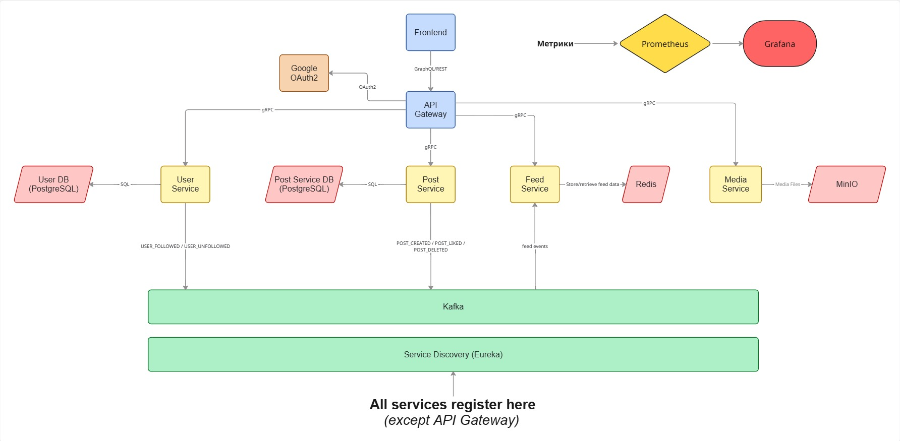

# UniMeow

Университетская социальная сеть — место, где студенты и преподаватели общаются внутри своего университета и за его пределами.

**[unimeow.ru](https://unimeow.ru)**

---

## Что умеет UniMeow

- Вход через Google, верификация по университетскому email
- Посты с медиафайлами, лайки, вложенные комментарии
- Три типа ленты: рекомендации, подписки, лента университета
- Подписки на других пользователей
- Заявки на добавление университетов, факультетов и образовательных программ
- Административная панель для модерации

---

## Архитектура

## Стек

| Категория | Технология |
|---|---|
| Язык | Java 25 |
| Фреймворк | Spring Boot 4.0.5, Spring Cloud 2025.1.1 |
| Межсервисное взаимодействие | gRPC 1.63.0, REST (WebFlux/WebMVC) |
| Базы данных | PostgreSQL 16, Redis 7.4 |
| Брокер сообщений | Apache Kafka 4.0.0 |
| Объектное хранилище | MinIO |
| Сборка | Gradle 9.1.0 (multi-project Kotlin DSL) |
| Контейнеризация | Docker + Docker Compose |
| Мониторинг | Prometheus, Grafana |
| Frontend | Vite + React 18 |

---

## Документация

Подробное описание функционала, GraphQL/gRPC API, алгоритмов лент, схемы БД и ограничений — в [APP_FUNCTIONALITY.md](APP_FUNCTIONALITY.md).
