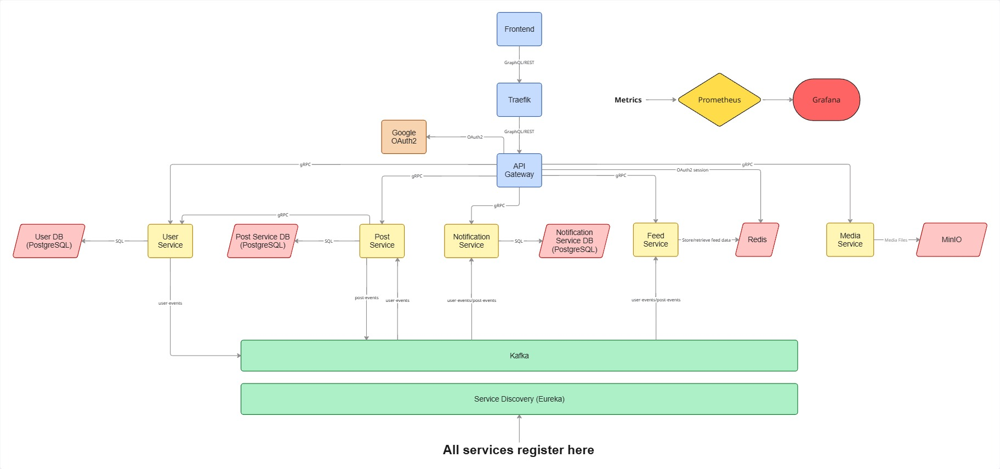

# UniMeow

Университетская социальная сеть — место, где студенты и преподаватели общаются внутри своего университета и за его пределами.

**[unimeow.ru](https://unimeow.ru)**

---

## Что умеет UniMeow

- Вход через Google, верификация по университетскому email
- Посты с медиафайлами, лайки, вложенные комментарии
- Три типа ленты: рекомендации, подписки, лента университета
- Подписки на других пользователей
- Заявки на добавление университетов, факультетов и образовательных программ
- Административная панель для модерации

---

## Архитектура



## Стек

| Категория | Технология |
|---|---|
| Язык | Java 25 |
| Фреймворк | Spring Boot 4.0.5, Spring Cloud 2025.1.1 |
| Межсервисное взаимодействие | gRPC 1.63.0, REST (WebFlux/WebMVC) |
| Базы данных | PostgreSQL 16, Redis 7.4 |
| Брокер сообщений | Apache Kafka 4.0.0 |
| Объектное хранилище | MinIO |
| Сборка | Gradle 9.1.0 (multi-project Kotlin DSL) |
| Контейнеризация | Docker + Docker Compose |
| Мониторинг | Prometheus, Grafana |
| Frontend | Vite + React 18 |

---

## Документация

Подробное описание функционала, GraphQL/gRPC API, алгоритмов лент, схемы БД и ограничений — в [APP_FUNCTIONALITY.md](APP_FUNCTIONALITY.md).

## Локальный запуск

Нужен Docker Compose. Для разработки используются `docker-compose.dev.yaml` и локальный `.env`. Перед первым запуском скопируйте `.env.example` в `.env`: в примере уже есть тестовые значения. Compose читает `.env` автоматически; этот файл не коммитится. Образы собираются по одному, чтобы несколько Gradle-процессов не занимали память одновременно. Команды ниже — для Bash, в том числе Git Bash на Windows:

```sh
cp -n .env.example .env
for service in eureka-server media-service user-service post-service feed-service notification-service api-gateway frontend; do
  docker compose -f docker-compose.dev.yaml build "$service" || exit 1
done
for service in socket-proxy traefik eureka-server media-service user-service post-service feed-service notification-service api-gateway frontend prometheus grafana; do
  docker compose -f docker-compose.dev.yaml up -d --wait "$service" || exit 1
done
```

Frontend: http://localhost:5173, API: http://localhost:8082. Для настоящего Google OAuth укажите свои `GOOGLE_CLIENT_ID` и `GOOGLE_CLIENT_SECRET` в локальном `.env` или окружении процесса.

Frontend остаётся одним контейнером: его Nginx раздаёт HTML, CSS и JavaScript на порту 5173. React выполняется в браузере и отправляет API-запросы через отдельный Traefik на порту 8082. Traefik автоматически обнаруживает Gateway текущего Compose-проекта и распределяет запросы между готовыми экземплярами. На production перед ним остаётся серверный Nginx с существующими доменами и HTTPS. Межсервисные gRPC-вызовы распределяются через Eureka. Например, второй Gateway запускается так:

```sh
docker compose -f docker-compose.dev.yaml up -d --no-deps --wait --scale api-gateway=2 api-gateway
```

Для возврата к одной реплике укажите `=1`. Аналогично масштабируются UserService, PostService, FeedService, MediaService и NotificationService по их именам в Compose. Ansible сохраняет установленное количество их реплик при выпуске и откате; старый выпуск с фиксированными именами контейнеров запускается в одном экземпляре.

Traefik обращается к Docker через готовый `socket-proxy`: разрешены необходимые операции чтения, изменения запрещены. Его порт доступен только Traefik в отдельной внутренней сети. Метаданные контейнеров остаются доступны этому соединению. Маршрутизация ограничена сервисом `api-gateway` текущего Compose-проекта, поэтому работает и с исходным выпуском без новых Traefik labels. Access logs содержат метод, статус и адрес Gateway; cookies и OAuth query-параметры не записываются.

На сервере используются `docker-compose.prod.yaml` и приватный `.env.prod`. Production Compose запускает готовые образы из GHCR; секций сборки в нём нет. Публичные адреса frontend читает при запуске контейнера, поэтому смена адреса не требует пересборки образа.

GitHub собирает образы без production-секретов: настройки подключения нужны приложениям при запуске, а не при сборке. Во время Release Ansible вызывает серверный Compose с `-f docker-compose.prod.yaml --env-file .env.prod`, и тот передаёт настройки контейнерам. `.env.prod` не загружается в GitHub и не включается в образы; следующий релиз сохраняет его значения, меняя только `VERSION`.

MinIO закреплён как `ghcr.io/coollabsio/minio:RELEASE.2025-10-15T17-29-55Z`: это готовая [community-сборка из исходников MinIO](https://github.com/coollabsio/minio). Прежний образ `minio/minio` недоступен для скачивания; новый тег проверен настоящим `docker pull`.

## Сборка и выпуск

В GitHub Actions два workflow: **CI** и **Release**. CI выполняется последовательно на одной машине GitHub:

1. **Lint** — actionlint проверяет workflow, Docker Compose проверяет dev/prod-конфигурацию, Gradle запускает Spotless, PMD и SpotBugs.
2. **Build** — собираются восемь образов приложения, по одному.
3. **Test** — выполняются все Java-тесты через `gradlew test`, затем HTTP-тесты всего приложения с настоящими хранилищами.
4. **Push to GHCR** — прошедшие проверки образы публикуются с одним тегом версии, создаётся GitHub Release.

CI запускается при открытии/обновлении PR, push в `meow` или вручную. Публикация выполняется только для `meow` после успешных проверок. Получение исходников, установка Java и сохранение отчётов — служебные действия; отдельного этапа Redis нет. Отчёты тестов и PMD сохраняются на семь дней, в том числе при ошибке; замечания SpotBugs видны в логе Lint. Ошибки Spotless, PMD и SpotBugs блокируют CI. Версии имеют вид `v1.0.1`; при ручном запуске CI можно указать версию, иначе используется `v1.0.<номер запуска>`. Опубликованную версию нельзя перезаписать.

HTTP-тесты в `tests/e2e` проходят OAuth, создают двух пользователей, подписку, пост, лайк, комментарий и уведомления, читают ленту, загружают и скачивают файл. PostgreSQL, Kafka, Redis и MinIO настоящие. Google заменён явно тестовым OAuth-провайдером, поэтому внешний Google и отправка почты этим тестом не проверяются. Проверки Eureka, Prometheus и Grafana выполняются отдельно от пользовательского сценария. Тестовый Compose override меняет только OAuth endpoints Gateway; production его не использует.

Выпуск состоит из нескольких частей:

| Где | Что находится |
|---|---|
| Восемь образов в GHCR с одним тегом версии | Java-приложения, библиотеки, ресурсы, собранный frontend и его Nginx |
| Исходники по Git-тегу версии | Production Compose, SQL-миграции, настройки Prometheus и Grafana, dashboards |
| На сервере | Приватный `.env.prod`, HTTPS-конфигурация и сертификаты серверного Nginx |
| Docker volumes на сервере | Данные PostgreSQL, Redis, MinIO и остальных хранилищ; данные не являются частью выпуска |

Отдельный архив выпуска не создаётся: GitHub сам предоставляет Source code, а Release получает ту же версию через `actions/checkout` по тегу. CI копирует `.env.example` в `.env` и проверяет production Compose с собранными образами и этими тестовыми значениями. Версия образов берётся из окружения CI и имеет приоритет над `VERSION=local` в примере. Ansible берётся из репозитория workflow Release.

Чтобы установить выпуск: **GitHub → Actions → Release → Run workflow → version**. Публикация сборки сама по себе сервер не обновляет.

Release получает исходники выбранного тега и запускает [Ansible](deploy/release.yml). Это готовый инструмент, который подключается по SSH и выполняет перечисленные в YAML шаги: скачивает образы из GHCR, останавливает приложения, проверяет бэкап PostgreSQL, Redis и MinIO, переносит Compose, SQL и весь каталог Monitoring, запускает Flyway и последовательно поднимает сервисы. Образы на сервере не собираются. `.env.prod`, серверный Nginx и сертификаты остаются на сервере. Для первоначальной настройки нужны environment `production`, secrets `SSH_PRIVATE_KEY`, `SSH_KNOWN_HOSTS` и variables `SSH_HOST`, `SSH_USER`. SSH использует стандартный порт 22.

Первоначальная настройка балансировщика уже выполнена вручную через Ansible: API-маршруты серверного Nginx направлены на Traefik на локальном порту 8082. Последующие выпуски выполняются обычным Action Release. Ansible определяет доверенный адрес серверного Nginx из Docker-сети и сохраняет его в установленном Compose; новых полей `.env.prod` не требуется.

Traefik и socket-proxy скачиваются из публичных registry по закреплённым версиям. Они не входят в восемь собираемых образов приложения. Балансировка не отменяет согласованный простой на время бэкапа при Release.

Серверный Nginx задаёт публичные домен и порт для API и удаляет присланные клиентом `Forwarded` и `X-Forwarded-Prefix`. При первоначальной настройке проверено, что поддельные proxy-заголовки не меняют HTTPS callback OAuth. Обычный Release эту проверку не выполняет.

## Возврат версии и бэкап

В том же Action **Release** можно выбрать ранее опубликованную версию. Возвращается код; данные остаются текущими. Старый код должен быть совместим с текущей схемой БД. Другой вариант — сделать `git revert`, пройти CI и выпустить новую версию с отменёнными изменениями.

Старый `v1.0.0` выпущен до этого CI: Ansible читает его прежний `docker-compose.yml`, подставляет сохранённые образы `v1.0.0` вместо сборки и сохраняет Traefik с socket-proxy. Эти исходные образы сохранены на действующем сервере; для нового сервера потребуется их перенос из резервной копии.

Перед каждым выпуском работающей установки Ansible останавливает приложения и сохраняет три PostgreSQL-базы, Redis и MinIO. Redis и MinIO ненадолго останавливаются для полной копии их данных. Восстановление проверяется в отдельных временных контейнерах. Только после успешной проверки новый `/var/backups/unimeow/latest.tar.gz` заменяет предыдущий архив. Если установка нездорова или предыдущий выпуск не завершился, Release сохраняет последний проверенный бэкап. При ошибке выпуска Ansible пытается запустить предыдущие приложения; данные автоматически не восстанавливаются.

`latest.tar.gz` содержит только данные: `user.dump`, `post.dump`, `notification.dump`, каталоги `redis/` с RDB/AOF и `minio/` с объектами и метаданными. Кода приложения в нём нет. Восстановление выполняется вручную: `pg_restore` для PostgreSQL, полная замена данных остановленных Redis/MinIO из копии. Проверять восстановление сначала следует на отдельных volumes. Kafka в архив не входит: после возврата к старым данным её очередь и позиции чтения проверяются отдельно. Архив хранится на том же сервере и не защищает от потери всего диска.
